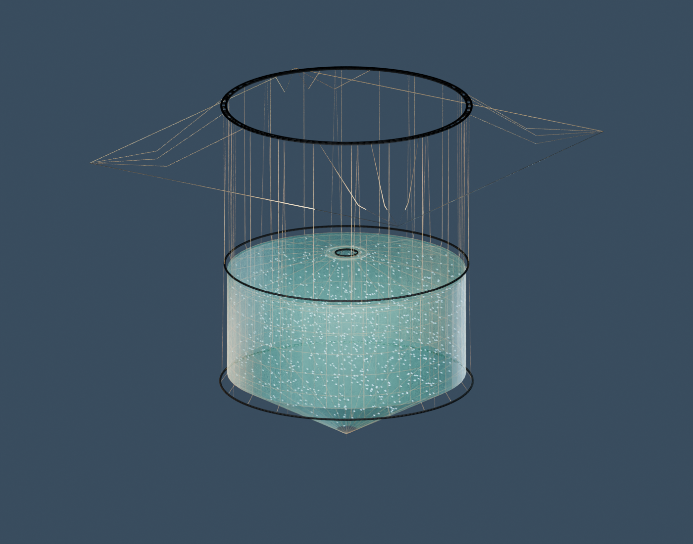
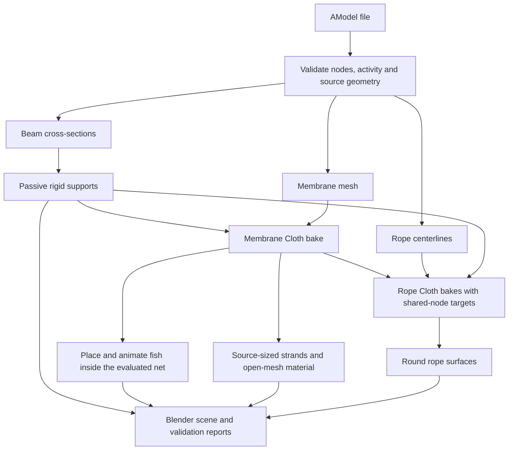
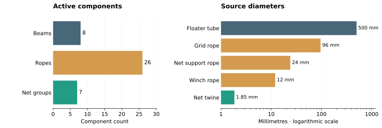
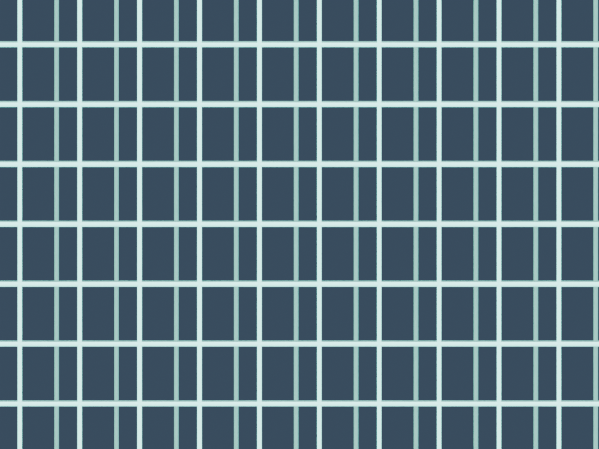

# Sim2Blender

Turn AquaSim `.amodel` files into a Blender fish-cage scene with **deformable netting and ropes, rigid beam supports, and 1,000 animated fish**. The same reader exports active geometry to OBJ, VTP and optional matplotlib plots.



## Build the scene

Tested with **Blender 5.2**. Blender already includes the Python needed for scene generation; no package installation is required for this command. Run from the repository root in PowerShell:

```powershell
$blender = 'C:/Program Files/Blender Foundation/Blender 5.2/blender.exe'
& $blender --background --factory-startup --python-exit-code 1 `
  --python scripts/build_scene.py -- examples/models/winch_cage.amodel `
  --cap-openings --pin-top --fish-count 1000 --frames 120
```

Open **`output/fish_cage.blend`** and play frames 1–120. Use **Material Preview** or **Rendered** shading to see the net openings; Solid mode does not show material transparency. Press **F12** for the studio render.

The supplied WINCH model has two open boundaries. `--cap-openings` adds virtual containment caps, while `--pin-top` adds explicit rim supports. Both choices are recorded in the scene. Generated files are kept in the ignored `output/` folder.

You can replace the input with `examples/models/riktig_amodel_ULS.amodel` using the same flags. Its coarse/fine membrane seam is joined automatically through existing source nodes; only its top opening receives a virtual cap. Add `-o output/riktig_cage.blend` to keep both generated examples.

| Input | Default | Purpose |
|---|---:|---|
| `--fish-count` | `1000` | Number of fish; use `0` for a cage-only scene |
| `--frames` | `120` | Simulation and animation duration at 24 fps |
| `--fish-length` | `0.6` | Fish size parameter, in source metres |
| `--speed` | `0.6` | Fish movement, metres per second |
| `--seed` | `7` | Repeatable placement and movement |
| `--membrane-ids` | all active | Restrict the enclosing membrane components |
| `-o`, `--output` | `output/fish_cage.blend` | Destination scene |

Changing geometry, physics or attachments requires a full rebuild because downstream rope targets and fish motion depend on the baked net.

## How it works



Only active elements are included. Source XYZ coordinates, beam profiles, rope diameters and node constraints are preserved. The example has **26 rope Cloth objects**, **8 passive rigid beam objects**, and one membrane Cloth object containing **7 active membrane groups**.



## Net visualization

The net combines source-sized finite-element edge strands with a **packed open-mesh material**. Metric UV coordinates use each membrane's twine diameter and `maskwidthy` / `maskwidthz` spacing. Transparent openings, rounded-twine bump shading and soft studio lights make the surface readable while preserving visibility into the cage. Texture filtering averages tiny openings in distant views.



This is a **visual lattice on the cloth surface**, not millions of additional collision strands. It follows the cloth deformation and does not alter the physics mesh or fish enclosure. All textures are packed into the `.blend`; no external image downloads are needed.

Refresh only the material and lighting of an existing generated scene:

```powershell
& $blender --background output/fish_cage.blend --python-exit-code 1 `
  --python scripts/refresh_scene.py
```

This updates the opened file and writes a preview beside it, preserving its cloth bakes.

## Export and inspect geometry

For ordinary Python **3.11+**, install the package once:

```powershell
python -m pip install -e .
python -m sim2blender.obj examples/models/winch_cage.amodel
python -m sim2blender.vtp examples/models/winch_cage.amodel
```

Optional plots:

```powershell
python -m pip install -e '.[plots]'
python -m sim2blender.plot examples/models/winch_cage.amodel -o output/components.png
python -m sim2blender.plot examples/models/winch_cage.amodel --nodes-only -o output/nodes.png
```

OBJ contains geometry only. VTP also preserves source IDs and per-axis translation flags. Use the direct Blender builder for physics and materials.

## Project layout

```text
src/sim2blender/     Shared reader, section interpretation, exports and plotting
  blender/          Scene builder, geometry, rope dynamics and shading
scripts/            Blender entry points and documentation rendering
examples/models/    Four source AModel examples
examples/reference/ Original reference Blender scene
output/             Generated scenes, previews and validation reports (ignored)
tests/              Pure-Python, Blender and saved-scene checks
docs/               Modeling notes, development guide and visual assets
```

The old root-level converters are replaced by the package commands above. The long WINCH input filename is now `examples/models/winch_cage.amodel`. Source examples and the original reference scene are retained; obsolete wrappers, probes, caches and redundant generated exports have been removed.

## Verification and limits

The WINCH trial passes **120,000 fish-containment checks** and **385,080 shared-node comparisons** over 120 frames. The saved scene retains all 27 cloth bakes and 244 source node constraints. Tests also check cross-section dimensions, rope sag, attachment motion and net texture coverage.

This is an illustrative animation, not an AquaSim solver replacement. Attachments are coupled one way; beams stay stationary; buoyancy, winch actuation, reaction-force feedback and detailed rope contact are not simulated. Fish containment is checked at integer frames, and unsafe positions may be relocated as the net moves.

See [modeling assumptions](docs/modeling.md) for geometry and physics details, or [development and validation](docs/development.md) for test commands and report regeneration.
