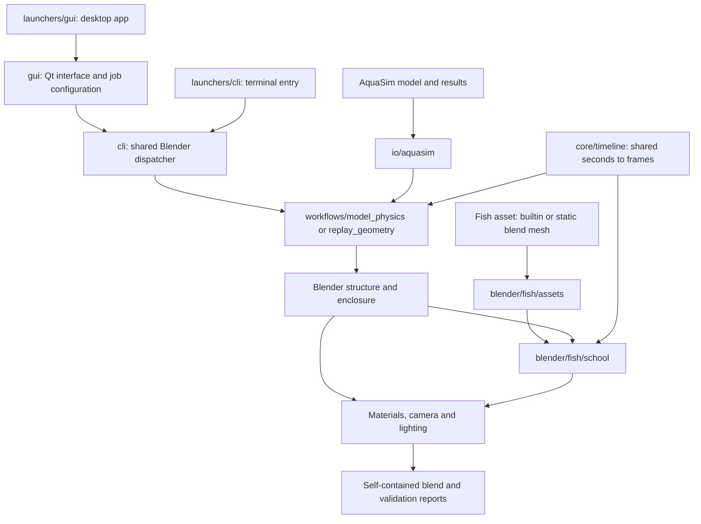

# Architecture

Sim2Blender currently visualizes AquaSim geometry/results and generates artistic fish motion. Source-specific parsing, physical time, Blender components and complete workflows have separate responsibilities.

## Dependency boundaries

| Area | Owns | Must avoid |
|---|---|---|
| `launchers/gui/`, `launchers/cli/` | Starting the selected interface from a checkout | Geometry or workflow logic |
| `gui/` | Desktop UI, asynchronous input inspection, job configuration and process monitoring | Importing `bpy` into the Qt process |
| `cli/` | Shared Blender workflow dispatch for terminal and GUI jobs | Duplicating workflow implementations |
| `core/` | Shared paths and seconds-to-frame conversion | Blender imports and solver-specific parsing |
| `io/aquasim/` | Source validation, IDs, connectivity, section interpretation and positions | Scene creation or fish behavior |
| `exporters/` | OBJ/VTP exports and optional inspection plots | Solver or fish simulation |
| `blender/enclosure.py` | Boundary stitching, virtual caps and full-geometry containment | Knowledge of AquaSim file syntax |
| `blender/fish/` | Appearance templates and schooling | Parsing structural result files |
| Other `blender/` modules | Structural geometry, physics, shading and presentation | Workflow CLI parsing |
| `workflows/` | Stage ordering, options, output artifacts and source/component wiring | Duplicating reusable parsers or containment logic |
| `scripts/` | Compatibility launchers and maintenance utilities | New application entry-point implementations |

`workflows/model_physics.py` assembles the illustrative cloth scene. `replay_geometry.py` stores source motion as absolute shape keys. `replay_fish.py` builds a separate hidden enclosure, adds schooling, and styles the replay. These are distinct orchestrators sharing the same components.

`workflows/replay_pipeline.py` composes replay geometry and optional schooling in one process. It is exposed as CLI `replay-scene` and used by the desktop application; neither interface owns its own copy. Both interfaces invoke `cli/blender_entry.py`. Legacy bridges under `gui/` and `scripts/` forward to these canonical modules.

User inputs can live in `inputs/models/` and `inputs/results/`, while reference inputs retain their paths under `examples/`. Outputs and GUI settings remain in `output/`. No scene or source file needs relocation merely to use either interface.

## Shared time and units

Use metres, seconds and a common XYZ convention inside the project. Preserve source IDs and document every unit/axis transformation. Importers must not silently treat displacement as absolute position.

`core.timeline.frames_from_seconds(times, fps, origin_seconds)` maps every source onto `1 + (time-origin_seconds)*fps`. Different sources must use the **same origin**, not independently reset their first sample to frame 1. Fractional frames are intentional. `sample_frames()` is the uniform-sampling convenience used by the AquaSim adapter.

`wave_timing()` derives the sample interval and GUI totals from period, exported intervals per wave and results sample count. The results inspector shares the streaming validator with the full reader, so counting frames does not load the full position history into the GUI. See [timing](guides/timing.md).

Fish appearance is an implemented extension port; see the [asset guide](guides/fish-assets.md). Particle and CFD interfaces below are proposed designs, not callable adapters.

## Proposed particle and field boundaries

Particle adapters should emit snapshots with `time_seconds`, stable `particle_id`, `position_m` and a positive `radius_m` (or explicit shape/size); orientation and velocity are optional. Define birth/death intervals so IDs are never interpolated across different particles. Convert source units in the adapter, then let a Blender particle renderer instance reusable pellet assets. A Blender-native pellet simulation should expose equivalent snapshots for export and verification.

CFD adapters should keep mesh topology/coordinates separate from timestamped point/cell fields. Record each field's association, units, component count and name. A rendering layer can later turn selected scalar/vector fields into colors, slices, volumes or streamlines without embedding OpenFOAM parsing in material code.

Particle/field data may be much larger than the current structural shape-key data. Choose streaming/cache storage and level-of-detail only after representative datasets and access patterns are known. Do not copy the per-fish object/keyframe approach to millions of pellets.

Planned destinations are `io/particles/`, `blender/particles/`, `io/cfd/`, `blender/fields/`, and workflow modules that compose them. These packages are intentionally not created as nonfunctional stubs. See the [roadmap](roadmap.md) for scope and acceptance criteria.
